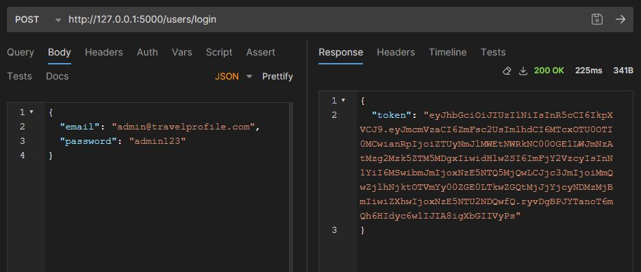
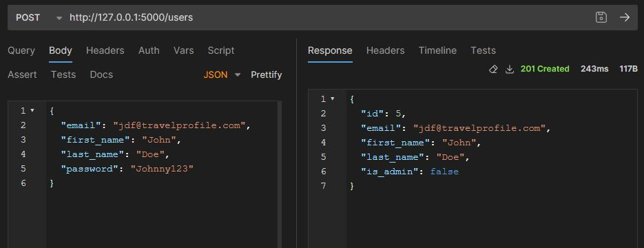

# Customer Profile API

- [R1 - Explain the problem that this app will solve, and explain how this app solves or addresses the problem.](#R1)

- [R2 - Describe the way tasks are allocated and tracked in your project.](#R2)

- [R3 - List and explain the third-party services, packages and dependencies used in this app.](#R3)

- [R4 - Explain the benefits and drawbacks of this app’s underlying database system.](#R4)

- [R5 - Explain the features, purpose and functionalities of the object-relational mapping system (ORM) used in this app.](#R5)

- [R6 - Design an entity relationship diagram (ERD) for this app’s database, and explain how the relations between the diagrammed models will aid the database design.](#R6)

- [R7 - Explain the implemented models and their relationships, including how the relationships aid the database implementation.](#R7)

- [R8 - Explain how to use this application’s API endpoints.](#R8)

<a id="R1"></a>
### R1 - Explain the problem that this app will solve, and explain how this app solves or addresses the problem.

This app has been created to address the problem of customer data management for a travel agency.  The app tracks users who have either added themselves or been added by the admin user.  Once their user profile is in the database, a passport can be added to a user.  Adding a passport allows for ease of access when booking travel overseas.  The different loyalty programs currently on offer are displayed in the database, when more rewards are offered, they are added to loyalties.  Users can be filtered into their travel groups to make it simpler for them to travel together with their information being stored in their group of travel companions.

<a id="R2"></a>
### R2 - Describe the way tasks are allocated and tracked in your project.

In my project I utilized the Kanban agile methodology.  Before I started work on my code I created my ERD and broke the project into several areas to help manage the moving parts.  I utilized Trello as my software of choice and I took screenshots of my Trello board as I continued to work on my API webserver.


First screenshot upon creation of the Trello board.  The board lists out several areas of focus for the period of my API webserver project.


This second screenshot shows that I added items to my To Do and Doing lists to breakdown what is required in each of my entity endpoints.


Screenshots of progress throughout development.


The last two screenshots of my Trello board have created a second 'Done' table for readability.


<a id="R3"></a>
### R3 - List and explain the third-party services, packages and dependencies used in this app.

The software used in this project:

- Flask
- PostgreSQL
- SQLAlchemy
- Marshmallow
- Psycopg2
- JWT Manager
- Bcrypt

#### Flask:
I used flask framework for creating my routes that are used in the app.  These routes are used for deciding what will happen when a request is made.

#### PostgreSQL:
I chose PostgreSQL for my database, the place where all of the information inside my app is stored.

#### SQLAlchemy:
My app relies on SQLAlchemy as the tool to communicate with the database with interactions with PostgreSQL. SQLAlchemy allows the application of Object Orientated Programming in the databse and allows a more robust use of databse and SQL commands.

#### Marshmallow:
The use of Marshmallow is required for object serialization in my flask app.  It is the tool used for creating my entity schemas.  Marshmallow also allows for the use of JSON serialization, returning and accepting JSON responses.

#### Psycopg2:
Psycopg2 is a python library, it is used to interact with the my PostgreSQL database from within the python application.  Its primary focus is to allow communication with the PostgreSQL database and the python app.

#### JWT Manager:
This is the tool that is used for managing authentication.  JWT manager will take a hashed password and store it as a token. This token can be used across different endpoints so the user does not need to log in every time.  The manager is for creating, storing and checking the tokens.

#### Bcrypt:
Bcrypt is used to encrypt and decrypt passwords.  Bcrypt will hash a password before it is stored in the JWT manager as a token.  This is a method for keeping the database secure.

<a id="R4"></a>
### R4 - Explain the benefits and drawbacks of this app’s underlying database system.

This app utilizes PostgreSQL.  PostgreSQL is a popular often used database open-source Relational Database Management System (RDBMS), it is know for its extensibility, adherence to SQL standards and for its robustness.  Here are its benefits and drawbacks:

#### <ins>Benefits</ins>

__Feature Rich:__ PostgreSQL includes a large range of features which include support for complex queries, indexing and JSON data types.  PostgreSQL also supports various extensions that offer additional functionalities.

__Extensibility:__ Using postgresql will allow the user to define their own data types, indexing methods and procedural languages through extensions.  This making it flexible and suitable for an array of uses.

__Scalability:__ PostgreSQL has the ability to handle high loads and large data volumes.  This is due to it having multi-version concurrency control (MVCC) support. MVCC allows for the efficient handling of concurrent transactions.

__Reliability:__ PostgreSQL is known for its reliability and stability, often being chosen for mission-critical applications when uptime and data integrity is essential.

#### <ins>Drawbacks</ins>

__Complexity:__ It can be more complex than other RDBMS such as MySQL to set up and optimize PostgreSQL, this is especially true to people who are new to database administration.

__Learning Curve:__ As postgresql has a large feature set and advanced capabilities, it may have a steeper learning curve for beginners when compared to other simpler databases

__Performance:__ PostgreSQL generally performs well, however, some benchmarks display that it can be slightly slower than some of the other databases when under certain conditions.  Performance can be dependent on the specific use case, configurations and the optimizations of the database.

Sources: 

https://www.tessell.com/blogs/postgresql-concepts-benefits-and-use-cases

https://www.boltic.io/blog/postgresql-performance-vs-mysql

<a id="R5"></a>
### R5 - Explain the features, purpose and functionalities of the object-relational mapping system (ORM) used in this app.

SQLAlchemy is the ORM used in this application.  SQLAlchemy is a popular ORM for Python that acts as a middle layer between Object-Oriented Programming (OOP) and relational databases.  Here is a breakdown of its Features, Purpose and Functionalities.

#### <ins>Features</ins>
Useful SQLAlchemy features:

- Groups database operations and flushes them for efficiency in batches.
- Flexible relationship mapping, handling various relationships between objects.
- Utilizes CRUD operations.  Create, read, update and delete data using objects.
- Offers low-level functionalities for raw SQL interaction when needed.

#### <ins>Purpose</ins>
The purpose of SQLAlchemy is to: 

- Simplify the interactions with relational databases, using object orientated concepts.  
- Reduce the need for writing raw SQL queries and statements
- Provide a layer of abstraction for database access

#### <ins>Functionalities</ins>
Important SQLAlchemy functionalities:

- Define object models.  You create python classes representing the tables in your database, including attribute mapping to table columns.
- SQLAlchemy can automatically generate the CREATE TABLE statements based on your provided models.
- Utilizes object-oriented syntax to construct queries for retrieving data.
- SQLAlchemy is database agnostic, working with a wide variety of relational databases like PostgreSQL and MySQL.

<a id="R6"></a>
### R6 - Design an entity relationship diagram (ERD) for this app’s database, and explain how the relations between the diagrammed models will aid the database design.

The relations in the below diagram will assist in the database design by providing me with a visual view of how the database will be structured.  Providing me with a guide on how to define my models and create my tables in the database.

Following the relationships designed in the ERD show me how to define each models interaction with each other inside of th database


<a id="R7"></a>
### R7 - Explain the implemented models and their relationships, including how the relationships aid the database implementation.

My application uses four different models.  These models are related to each other differently and are linked through the use of foreign keys.   All of my models are linked to users, but have no relationship to each other.  Below shows each model and their relationships with each other.

 - Each user can have a single passport, and a passport can only belong to one user. This is a one-to-one relationship.

 - A user can have many loyalties as they wish.  A loyalty can only belong to a single user.  This is a many-to-one relationship.

 - Each group can have between two and four users attached as group members.  A user can belong to as many groups as they wish.  This is a many-to-many relationship.

#### Users:
The user model represents the customers who will be providing their data to be stored as well as the admin who has the authorization to access the stored data.
User information stored is their User ID (Primary Key), email, first and last names (last name is not required), password and if they are admin, which is set to false by default to ensure new users created are not provided with the admin authorization.

```py
class User(db.Model):
    __tablename__ = "users"

    id = db.Column(db.Integer, primary_key=True)
    email = db.Column(db.String(100), unique=True, nullable=False)
    first_name = db.Column(db.String(100), nullable=False)
    last_name = db.Column(db.String(100))
    password = db.Column(db.String, nullable=False)
    is_admin = db.Column(db.Boolean, server_default='false')

    passports = db.relationship(
        'Passport', back_populates='user', cascade='all,delete')
    loyalties = db.relationship(
        'Loyalty', back_populates='user', cascade='all,delete')

    first_member = db.relationship(
        'Group', foreign_keys='Group.first_member_id',
        back_populates='first_member',
        primaryjoin='User.id == Group.first_member_id', cascade='all,delete')
    second_member = db.relationship(
        'Group', foreign_keys='Group.second_member_id',
        back_populates='second_member',
        primaryjoin='User.id == Group.second_member_id', cascade='all,delete')
    third_member = db.relationship(
        'Group', foreign_keys='Group.third_member_id',
        back_populates='third_member',
        primaryjoin='User.id == Group.third_member_id', cascade='all,delete')
    fourth_member = db.relationship(
        'Group', foreign_keys='Group.fourth_member_id',
        back_populates='fourth_member',
        primaryjoin='User.id == Group.fourth_member_id', cascade='all,delete')
```

#### Passports:
Sensitive information regarding each users identity.  This information is only available to the admin and includes; Passport ID (Primary Key), issue and birth country, passport number, issue and expiration date, as well as the user ID for whomever the passport belongs to.

```py
class Passport(db.Model):
    __tablename__ = "passports"

    id = db.Column(db.Integer, primary_key=True)
    issue_country = db.Column(db.String, nullable=False)
    birth_country = db.Column(db.String, nullable=False)
    passport_number = db.Column(db.String, nullable=False)
    issue_date = db.Column(db.Date, nullable=False)
    expiration_date = db.Column(db.Date, nullable=False)
    user_id = db.Column(db.Integer, db.ForeignKey('users.id'), nullable=False)

    user = db.relationship('User', back_populates='passports')
```

#### Loyalties:
Loyalties are the loyalty rewards provided from a supplier to a user.  These are stored with the keys: supplier, type and user_id.  The supplier is the company that is supplying the reward and the type is the type of reward they are providing to the loyal customer, linked by user_id.

```py
class Loyalty(db.Model):
    __tablename__ = "loyalties"

    id = db.Column(db.Integer, primary_key=True)
    supplier = db.Column(db.String, nullable=False)
    type = db.Column(db.String, nullable=False)
    user_id = db.Column(db.Integer, db.ForeignKey('users.id'), nullable=False)

    user = db.relationship('User', back_populates='loyalties')
```

#### Groups:
Travel groups can have between two and four members at a time.  This is achieved by assigning a user_id to each member_id then using the member_id in the table to create a new group.  Additionally, each travel group must have a unique name to help distinguish between other groups in the database in a friendly view other than by the primary key ID.

```py
class Group(db.Model):
    __tablename__ = "groups"

    id = db.Column(db.Integer, primary_key=True)
    name = db.Column(db.String(300), unique=True, nullable=False)
    first_member_id = db.Column(
        db.Integer, db.ForeignKey('users.id'),
        nullable=False)
    second_member_id = db.Column(
        db.Integer, db.ForeignKey('users.id'),
        nullable=False)
    third_member_id = db.Column(
        db.Integer, db.ForeignKey('users.id'),
        nullable=True)
    fourth_member_id = db.Column(
        db.Integer, db.ForeignKey('users.id'),
        nullable=True)

    # Specific foreign keys
    first_member = db.relationship(
        'User', foreign_keys=[first_member_id],
        back_populates='first_member')
    second_member = db.relationship(
        'User', foreign_keys=[second_member_id],
        back_populates='second_member')
    third_member = db.relationship(
        'User', foreign_keys=[third_member_id],
        back_populates='third_member')
    fourth_member = db.relationship(
        'User', foreign_keys=[fourth_member_id],
        back_populates='fourth_member')
```


<a id="R8"></a>
### R8 - Explain how to use this application’s API endpoints. 

#### User Endpoints

User/Admin login

- HTTP verb: POST
- Path or route: /users/login
- Any required body or header data: Email and password for existing user
- Response: '200 OK' JSON response showing JWT token



Get all users 

- HTTP verb: GET
- Path or route: /users
- Any required body or header data: N/A
- Response: '200 OK' JSON response showing all users in database; id, email, first and/or last name, and if they are an admin.
- Authentication: JWT Token


Get a user

- HTTP verb: GET
- Path or route: /users/{id}
- Any required body or header data: N/A
- Response: '200 OK' JSON response showing the selected user in the database.
- Authentication: JWT token


Add a user

- HTTP verb: POST
- Path or route: /users
- Any required body or header data: Email, first name, last name (optional) & password
- Response: '201 Created' JSON response showing added user including ID and if admin, but excluding password.



Update a user

- HTTP verb: PUT
- Path or route: /users/{id}
- Any required body or header data: Email, first name, last name (optional) & password
- Response: '200 OK' User ID with updated details
- Authentication: JWT token


Delete a user

- HTTP verb: DELETE
- Path or route: /users/{id}
- Any required body or header data: N/A
- Response: '200 OK' JSON response "User deleted"
- Authentication: JWT token


#### Loyalty Endpoints

Get all loyalties

- HTTP verb: GET
- Path or route: /loyalties
- Any required body or header data: N/A
- Response: '200 OK' JSON response displaying all loyalties currently in the system including the ID, supplier, type, user ID and user information; First name & last name (If provided).
- Authentication: JWT token


Get a loyalty

- HTTP verb: GET
- Path or route: /loyalties/{id}
- Any required body or header data: N/A
- Response: '200 OK' JSON response displaying the selected loyalty including the user information.
- Authentication: JWT token


Add a loyalty

- HTTP verb: POST
- Path or route: /loyalties
- Any required body or header data: Supplier, type & user_id
- Response: '201 Created' JSON response displaying the added loyalty including the user information.
- Authentication: JWT token


Update a loyalty

- HTTP verb: PUT
- Path or route: /loyalties/{id}
- Any required body or header data: Supplier & type
- Response: '200 OK' JSON response displaying the selected loyalty with the updated information, including user information.
- Authentication: JWT token


Delete a loyalty

- HTTP verb: DELETE
- Path or route: /loyalties/{id}
- Any required body or header data: N/A
- Response: '200 OK' JSON response "loyalty deleted"
- Authentication: JWT token


#### Passport Endpoints

Get all passports

- HTTP verb: GET
- Path or route: /passports
- Any required body or header data: N/A
- Response: '200 OK' JSON response showing all passports in the database, including all the passport information; ID, issue and birth country, passport number, issue and expiration date, and the user details including ID, first and last names.
- Authentication: JWT token


Get a passport

- HTTP verb: GET
- Path or route: /passports/{id}
- Any required body or header data: N/A
- Response: '200 OK' JSON response showing only the selected passport with passport info and user info.
- Authentication: JWT token


Add a passport

- HTTP verb: POST
- Path or route: /passports
- Any required body or header data: issue_country, birth_country, passport_number, issue_date, expiration_date & user_id
- Response: '201 OK' JSON response showing the new passport with all passport and user information with the newly created passport ID.
- Authentication: JWT token


Update a passport

- HTTP verb: PUT
- Path or route: /passports/{id}
- Any required body or header data: issue_country, birth_country, passport_number, issue_date & expiration_date
- Response: '200 OK' JSON response showing the updated passport information with user information.
- Authentication: JWT token


Delete a passport

- HTTP verb: GET
- Path or route: /passports/{id}
- Any required body or header data: N/A
- Response: '200 OK' JSON response "Passport deleted and removed from user"
- Authentication: JWT token


#### Group Endpoints

Get all groups

- HTTP verb: GET
- Path or route: /groups
- Any required body or header data: N/A
- Response: '200 OK' JSON response showing every group in database.  Group information displayed is: Group ID, name, first member details, second members details, third members details (optional) and fourth members details (optional).
- Authentication: JWT token


Get a group

- HTTP verb: GET
- Path or route: /groups/{id}
- Any required body or header data: N/A
- Response: '200 OK' JSON response showing the specific group in database.  Group information displayed with individual group members names displayed.
- Authentication: JWT token


Add a group

- HTTP verb: POST
- Path or route: /groups
- Any required body or header data: Group name, first_member_id, second_member_id, third_member_id (optional) & fourth_member_id (optional).
- Response: '200 OK' JSON response showing the added group with all member information, group name & group ID.
- Authentication: JWT token


Update a group

- HTTP verb: PUT
- Path or route: /groups/{id}
- Any required body or header data: Group name, first_member_id, second_member_id, third_member_id (optional) & fourth_member_id (optional).
- Response: '201 OK' JSON response showing the updated group with all member information, group name & group ID.
- Authentication: JWT token


Delete a group

- HTTP verb: Delete
- Path or route: /groups/{id}
- Any required body or header data: N/A
- Response: '200 OK' JSON response "Group deleted"
- Authentication: JWT token


